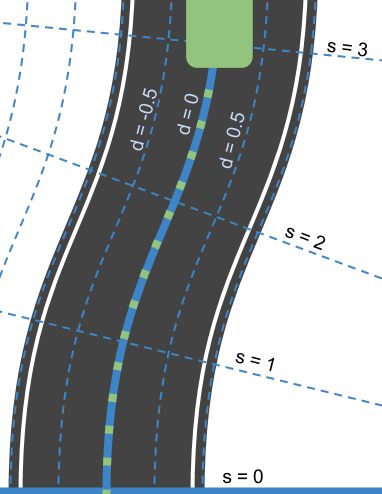

# Highway Driving

## CarND-Path-Planning-Project

Self-Driving Car Engineer Nanodegree Program

### Goals

In this project your goal is to safely navigate around a virtual highway with other traffic that is driving +-10 MPH of the 50 MPH speed limit. You will be provided the car's localization and sensor fusion data, there is also a sparse map list of waypoints around the highway. The car should try to go as close as possible to the 50 MPH speed limit, which means passing slower traffic when possible, note that other cars will try to change lanes too. The car should avoid hitting other cars at all cost as well as driving inside of the marked road lanes at all times, unless going from one lane to another. The car should be able to make one complete loop around the 6946m highway. Since the car is trying to go 50 MPH, it should take a little over 5 minutes to complete 1 loop. Also the car should not experience total acceleration over 10 m/s^2 and jerk that is greater than 10 m/s^3.

---
## Implementation of a Path Planner
Given the data flow for behavior control as seen in class:


*Modules for behavior control*

The first thing the car needs to do is localize itself and other objects. For that it makes use of the sensor fusion information provided by the simulator, in Frenet coordinates, to determine the position and velocity of other surrounding cars. Since sensor fusion information is marginally old, the position of the sensed cars is slightly adjusted by a time frame of delta 0.02 seconds.

     	

*Highway in XY coordinates        vs        Highway in SD coordinates*

Once the position of all detected vehicles is predicted, and taking into consideration the position and velocity of the car, it can determined if the current lane is free, blocked, if any adjacent lane is blocked or if the car can change to any of them. 

The gathered information defines the environment and the action to be taken. This information is fed into a finite state machine to transition the state of the car and decide if it can accelerate, has brake or should switch lanes. The implemented planner uses a finite state machine with 4 states:
 - Keep current lane
 - Follow blocking object
 - Change lane to the left
 - Change lane to the right

    

*Finite State Machine*

One could argue the need for a transition between Keep Lane and Change Lane and decide to transition to Follow first, since the blocking action is what defines the interest in changing lanes, but since sensor-acquisition takes place before trajectory planning, we can jump straight from a Keep Lane state to a Change Lane state since we already know we are blocked, thus saving a full **sensor>prediction>planing>motion** cycle.

For this project, the target velocity was set at 49.5mph, with a maximum acceleration value of 0.224mph/cycle and a maximum breaking deceleration of 0.448mph/cycle. The safety margin to other cars (both in front as behind the car on either adjacent lane) was set to 30. The margin distance is not considered when braking.

Running a simulation, the car completed a full lap in just under 6 minutes without incidents.


*1. Start of track, 0 to 50 in 27 seconds... a beast!*


*2. Car changing from right to middle lane*
> notice the group of 3 cars leading the group


*3. Blocked on the right, changing lane to the left.*
> a preference for 'left overtakes' was given to the trajectory planner, so it would have decided to change left anyway even if the right side would have been empty (as seen on image 7).


*4. Car changing from left to middle lane*


*5. Car on leftmost lane, blocked front and right*
> since no adjacent lane is free, the car reduced speed and stayed in the current lane following the car in front at a safe distance.
 


*6. Car blocked front and left, changes from middle to right lane*
> the car driving on the leftmost lane is still inside the *safe distance* area, so the planner decides to overtake on the right side... bad boy...


*7. Car blocked font, changes from middle to left lane (preferring left)*
> opposite to image 6. the car can now overtake on the left side, regardless of the status of the right side. This is tricked forcing a sensor fusion 'blocked right' flag when we detect the left side is clear, thus making a transition to *change right* impossible.


*8. After 6:45 minutes, the car reaches 5 miles without incidents*
> the car safely managed to complete a full lap without ever colliding with other cars, exceeding speed or jerk limits.

---
## Project infos and tips
### Simulator.

You can download the Term3 Simulator which contains the Path Planning Project from the [releases tab (https://github.com/udacity/self-driving-car-sim/releases/tag/T3_v1.2).

To run the simulator on Mac/Linux, first make the binary file executable with the following command:
```shell
sudo chmod u+x {simulator_file_name}
```
#### The map of the highway is in data/highway_map.txt
Each waypoint in the list contains [x,y,s,dx,dy] values. x and y are the waypoint's map coordinate position, the s value is the distance along the road to get to that waypoint in meters, the dx and dy values define the unit normal vector pointing outward of the highway loop.

The highway's waypoints loop around so the frenet s value, distance along the road, goes from 0 to 6945.554.

### Basic Build Instructions
1. Clone this repo.
2. Make a build directory: `mkdir build && cd build`
3. Compile: `cmake .. && make`
4. Run it: `./path_planning`.

Here is the data provided from the Simulator to the C++ Program

#### Main car's localization Data (No Noise)

["x"] The car's x position in map coordinates
["y"] The car's y position in map coordinates
["s"] The car's s position in frenet coordinates
["d"] The car's d position in frenet coordinates
["yaw"] The car's yaw angle in the map
["speed"] The car's speed in MPH

#### Previous path data given to the Planner

//Note: Return the previous list but with processed points removed, can be a nice tool to show how far along the path has processed since last time.
["previous_path_x"] The previous list of x points previously given to the simulator
["previous_path_y"] The previous list of y points previously given to the simulator

#### Previous path's end s and d values
["end_path_s"] The previous list's last point's frenet s value
["end_path_d"] The previous list's last point's frenet d value

#### Sensor Fusion Data, a list of all other car's attributes on the same side of the road. (No Noise)
["sensor_fusion"] A 2d vector of cars and then that car's [car's unique ID, car's x position in map coordinates, car's y position in map coordinates, car's x velocity in m/s, car's y velocity in m/s, car's s position in frenet coordinates, car's d position in frenet coordinates.

### Details

1. The car uses a perfect controller and will visit every (x,y) point it recieves in the list every .02 seconds. The units for the (x,y) points are in meters and the spacing of the points determines the speed of the car. The vector going from a point to the next point in the list dictates the angle of the car. Acceleration both in the tangential and normal directions is measured along with the jerk, the rate of change of total Acceleration. The (x,y) point paths that the planner recieves should not have a total acceleration that goes over 10 m/s^2, also the jerk should not go over 50 m/s^3. (NOTE: As this is BETA, these requirements might change. Also currently jerk is over a .02 second interval, it would probably be better to average total acceleration over 1 second and measure jerk from that.

2. There will be some latency between the simulator running and the path planner returning a path, with optimized code usually its not very long maybe just 1-3 time steps. During this delay the simulator will continue using points that it was last given, because of this its a good idea to store the last points you have used so you can have a smooth transition. previous_path_x, and previous_path_y can be helpful for this transition since they show the last points given to the simulator controller with the processed points already removed. You would either return a path that extends this previous path or make sure to create a new path that has a smooth transition with this last path.

### Tips

A really helpful resource for doing this project and creating smooth trajectories was using http://kluge.in-chemnitz.de/opensource/spline/, the spline function is in a single hearder file is really easy to use.

---
### Dependencies
* cmake >= 3.5
* All OSes: [click here for installation instructions](https://cmake.org/install/)
* make >= 4.1
* Linux: make is installed by default on most Linux distros
* Mac: [install Xcode command line tools to get make](https://developer.apple.com/xcode/features/)
* Windows: [Click here for installation instructions](http://gnuwin32.sourceforge.net/packages/make.htm)
* gcc/g++ >= 5.4
* Linux: gcc / g++ is installed by default on most Linux distros
* Mac: same deal as make - [install Xcode command line tools]((https://developer.apple.com/xcode/features/)
* Windows: recommend using [MinGW](http://www.mingw.org/)
*  [uWebSockets](https://github.com/uWebSockets/uWebSockets)
* Run either `install-mac.sh` or `install-ubuntu.sh`.
* If you install from source, checkout to commit `e94b6e1`, i.e.
```
git clone https://github.com/uWebSockets/uWebSockets
cd uWebSockets
git checkout e94b6e1
```

### Acknowledments
Thank you for some great libraries and tools!
* http://kluge.in-chemnitz.de/opensource/spline/
* https://github.com/eglimi/cppfsm/blob/master/fsm.h
* http://madebyevan.com/fsm/
* https://stackedit.io/